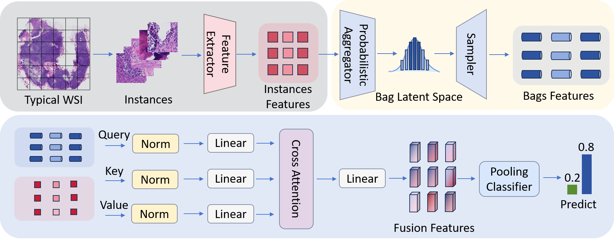

# RPMIL
This repository provides the code for the PyTorch implementation of **RPMIL: Rethinking Uncertainty-Aware Probabilistic Multiple Instance Learning for Whole Slide Pathology Diagnosis**, IJCAI 2025.
 
## For running on a local machine
- Linux
- Python 3.10.0, Torch 2.5.1
- Nvidia GeForce RTX 3090 GPU
  
## Whole Slide Image Data
Clink [Camelyon16](https://camelyon17.grand-challenge.org/Data/) and [TCGA-NSCLC](https://portal.gdc.cancer.gov/analysis_page?app=Downloads) to download original WSIs.

## Data Preprogressing
We use [CLAM](https://github.com/mahmoodlab/CLAM) to preprocess WSIs.
```
git clone https://github.com/mahmoodlab/CLAM.git
cd CLAM
conda env create -f env.yml
conda activate clam_latest
```
### Patching
`--preset` [bwh_biopsy.csv](preset/bwh_biopsy.csv) for C16 (*It's the preset parameters officially provided by CLAM*),<br>
`--preset` [preprocess_tcga_nsclc.csv](preset/preprocess_tcga_nsclc.csv) for TCGA-NSCLS (*It's the customized parameters*).
```shell
# for C16
python create_patches_fp.py --source DATA_DIRECTORY --save_dir RESULTS_DIRECTORY --patch_size 512 \
--step_size 512 --preset bwh_biopsy.csv --seg --patch
# for TCGA-NSCLC
python create_patches_fp.py --source DATA_DIRECTORY --save_dir RESULTS_DIRECTORY --patch_size 512 \
--step_size 512 --preset preprocess_tcga_nsclc.csv --seg --patch
```
### Feature Extraction
```shell
# for C16
CUDA_VISIBLE_DEVICES=0 python extract_features_fp.py --data_h5_dir DIR_TO_COORDS --data_slide_dir \
DATA_DIRECTORY --csv_path CSV_FILE_NAME --feat_dir FEATURES_DIRECTORY --batch_size 512 --target_patch_size=224 --slide_ext .tif
# for TCGA-NSCLC
CUDA_VISIBLE_DEVICES=0 python extract_features_fp.py --data_h5_dir DIR_TO_COORDS --data_slide_dir \
DATA_DIRECTORY --csv_path CSV_FILE_NAME --feat_dir FEATURES_DIRECTORY --batch_size 512 --target_patch_size=224 --slide_ext .svs
```

## Creating the virtual environment

    conda create -n rpmil python=3.10.0
    conda activate rpmil

## Getting the code

    git clone https://github.com/bravePinocchio/rpmil
    cd rpmil
    pip install -r requirements.txt

## Running the code

    CUDA_VISIBLE_DEVICES=0 python main.py
    
